# 3D L-system generator

Visit the app [here](https://gerizim16.github.io/3d-l-system-generator/).


The language: Stochastic, Parametric, Context-free, L-System.

## Syntax

### Symbols
Symbols may have parameters. They are of the format:

```
symbol{param1, param2, ...}
```

Parameters are separted by commas. Parameters are optional, thus, the following is also valid:
```
symbol
```

Symbols may either be:
- [Special symbols (commands)](#commands): uses lowercase characters. These symbols are used to control the turtle. Examples are: `+x`, `l`, `-z`.
- Non-special symbols (variables): uses uppercase characters. Examples are: `A`, `BRANCH`, `X`.

### Commands

| Symbol | Parameters | Description |
| -----: | :--------- | :---------- |
| `m{color, roughness, metalness, flatShading, fog, wireframe, transparent, opacity, side}` | <ul><li>`color`=`0xffffff` : color in hex<li>`roughness`=`0.1` : `[0, 1]`<li>`metalness`=`0.1` : `[0, 1]`<li>`flatShading`=`false` : `true` or `false`<li>`fog`=`true` : influence material with fog<li>`wireframe`=`false` : render as wireframe<li>`transparent`=`false` : enable transparency<li>`opacity`=`1` : opacity when transparency is enabled<li>`side`=`0` : `0`=render front side, `1`=render back side, `2`=render both sides</ul> | Set current turtle material. |
| `f{len}` | <ul><li>`len`=`defaults.length` : length</ul> | Move the turtle forward `len` units.
| `l{len, startR, endR}` | <ul><li>`len`=`defaults.length` : length<li>`startR`=`turtle.radius` : starting radius<li>`endR`=`turtle.radius` : ending radius</ul> | Draw a cylinder of `len` units and move forward `len` units starting with a radius of `startR` and ending with `endR`.
| `r{rad}` | <ul><li>`rad`=`defaults.radius` : radius</ul> | Set the radius of the turtle to `rad`.
| `s` | | Begin drawing a curve. |
| `e` | | End the curve, draw the finished curve. |
| `t{ten}` | <ul><li>`ten`=`0.5` : tension</ul> | Set the tension of the curve. `[0, 1]` |
| `+x{angle}` | <ul><li>`angle`=`defaults.angle` : angle in degrees</ul> | Pitch control. Increase pitch by `angle` degrees. |
| `-x{angle}` | <ul><li>`angle`=`defaults.angle` : angle in degrees</ul> | Pitch control. Decrease pitch by `angle` degrees. |
| `+y{angle}` | <ul><li>`angle`=`defaults.angle` : angle in degrees</ul> | Yaw control. Increase yaw by `angle` degrees. |
| `-y{angle}` | <ul><li>`angle`=`defaults.angle` : angle in degrees</ul> | Yaw control. Decrease yaw by `angle` degrees. |
| `-z{angle}` | <ul><li>`angle`=`defaults.angle` : angle in degrees</ul> | Roll control. Increase roll by `angle` degrees. |
| `-z{angle}` | <ul><li>`angle`=`defaults.angle` : angle in degrees</ul> | Roll control. Decrease roll by `angle` degrees. |
| `[` | | Push state to stack. State includes turtle position, material, tension, radius |
| `]` | | Pop state from stack and set it to current state. |
| `sphere{r, widthSeg, heightSeg, phi, phiLen, theta, thetaLen}` | <ul><li>`r`=`defaults.size/2` : radius<li>`widthSegments`=`12` : number of horizontal segments `[3, inf)`<li>`heightSegments`=`6` : number of vertical segments `[2, inf)`<li>`phiStart`=`0` : horizontal starting angle<li>`phiLength`=`2*pi` : horizontal sweep angle size<li>`thetaStart`=`0` : vertical starting angle<li>`thetaLength`=`pi` : vertical sweep angle size</ul> | Draws a sphere centered at the turtle's position. May be used to draw "leaves": `m{0x50C878, 0.7, 0, false, true, false, true, 0.8, 2} sphere{random()/7+0.1, 12, 6, 0, pi/2, 0, pi}`<br>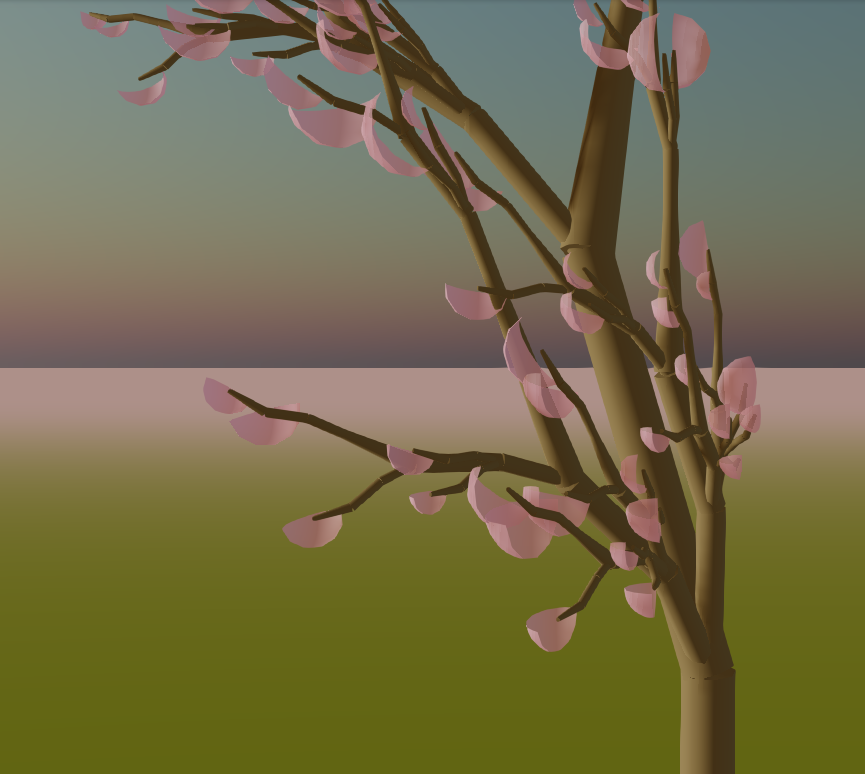 | 
| `box{w, h, d}` | <ul><li>`w`=`defaults.size` : width<li>`h`=`defaults.size` : height<li>`d`=`defaults.size` : depth</ul> | Draws a box centered at the turtle's position and aligned with the turtle's axes. |
| `cube{s}` | <ul><li>`s`=`defaults.size` : side length</ul> | Draws a cube centered at the turtle's position and aligned with the turtle's axes. |
| `cone{r, h, radialSeg}` | <ul><li>`r`=`defaults.size/2` : base radius<li>`h`=`defaults.size` : height<li>`radialSeg`=`8` : number of segmented faces around the circumference of the cone</ul> | Draws a cone centered at the turtle's position and aligned with the turtle's axes. Can be used to draw pyramids such as a square base pyramid: `cone{r, h, 4}`. |

### Axiom

Axiom is a list of symbols separated by whitespace character(s). It is of the format:

```
symbol1{param1_1, param1_2, ...} symbol2 ...
```

Parameters of symbols in an axiom must evaluate to a constant. Some valid constant parameters are:

```c
symbol{sin(pi/2)}   // 1
symbol{sin(30 deg)} // 0.5
symbol{pi}          // 3.1415926535898
symbol{1.2}         // 1.2
symbol{log(e)}      // 1
symbol{true}        // true
symbol{false}       // false
symbol{random()}
```

Parameters are evaluated using [math.js](https://mathjs.org/). More functions can be found [here](https://mathjs.org/docs/reference/functions.html).

### Production rules

Production rules are of the format:

```
symbol{var1, var2, ...} -> new_symbol1{param1, param2, ...} new_symbol2 new_symbol3 ...
```

Parameters of the symbol on the left hand side must be variables. For clarity, an example is the following:
```
symbol{a, b, c} -> new_symbol1{a + 1} new_symbol2{2 * b, c}
```

All parameters are optional. Thus, the following is also valid:

```
symbol -> new_symbol1 ...
```

Special symbols may be used in the left hand side in production rules. Thus, the following is valid:
```
+x -> +x l
```

### Simple examples

#### Simple
```
iterations: 2
axiom: X
production rules:
X -> +x l X

result:
+x l +x l X
```

#### Special symbol replacement
```
iterations: 2
axiom: l
production rules:
l -> +x l

result:
+x +x l
```

#### Stochastic
```
iterations: 2
axiom: START
production rules:
START -> A START
START -> B START

possible results:
A A START
A B START
B A START
B B START
```

#### Parametrized
```
iterations: 1
axiom: l{1}
production rules:
l{x} -> l{sin(x deg)} +x{x} l{2 * x}

result:
l{0.017452406437284} +x{1} l{2}
```
## Examples

### Plant
```
iterations: 4
axiom: m{0x594d30, 0.9, 0} A{0.2}
production rules:
A{r} -> l{0.2, r, r} +x +y +z [ [ A{r/2} ] -x A{r/2} ] -x -y -z l{0.2, r, r} [ -x l{0.2, r, r/2} A{r/2} m{0xf695c3, 0.7, 0} sphere ] +x A{r/2}
l{a, b, c} -> l{a*2.5, b, c}
l{a, b, c} -> l{a*2, b, c}
sphere -> sphere{random()/7+0.1}
```

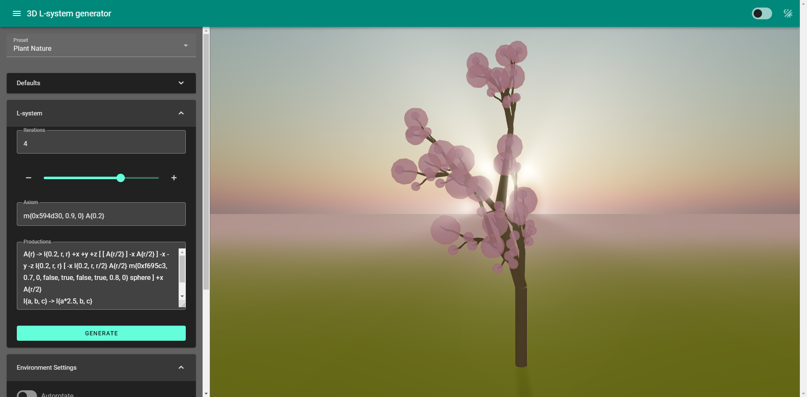

### Hilbert
```
iterations: 3
axiom: t{0.5} s X e
production rules:
X -> +x -z X f +x -z X f X +y f +x +z +z X f X -x f -y +z +z X f X +y f +z X +y +z
```

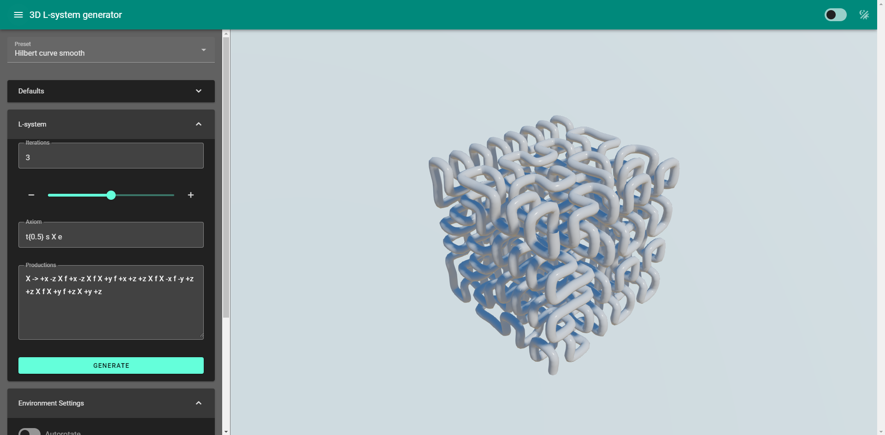

### Sierpinski
```
iterations: 3
axiom: m{0xffffff, 0.9, 0.9, true} f{8/2} cone{8, 8, 3}
production rules:
cone{s, s} -> f{s/4} cone{s/2, s/2, 3} f{-s/2} [ +x{90} f{s*sin(pi/6)} -x{90} cone{s/2, s/2, 3} ] [ +z{120} +x{90} f{s*sin(pi/6)} -x{90} cone{s/2, s/2, 3} ] [ -z{120} +x{90} f{s*sin(pi/6)} -x{90} cone{s/2, s/2, 3} ] f{s/4}
```

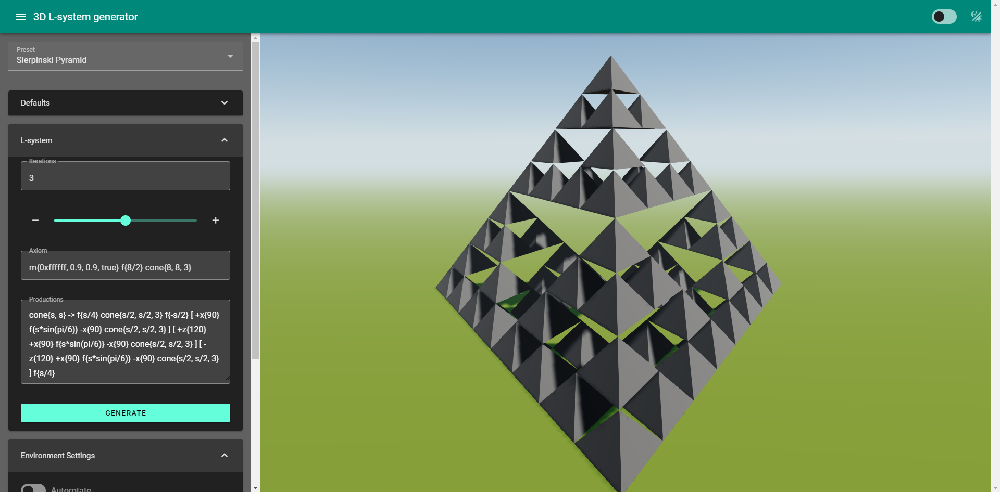

### Plant 2
```
iterations: 5
axiom: s m{0x228B22} t{0.3} f X e
production rules:
X -> f{1} X [ -x +z{183} +y{10} f{1} X ] [ +x +z{16} +y{5} f{1} X ]
```

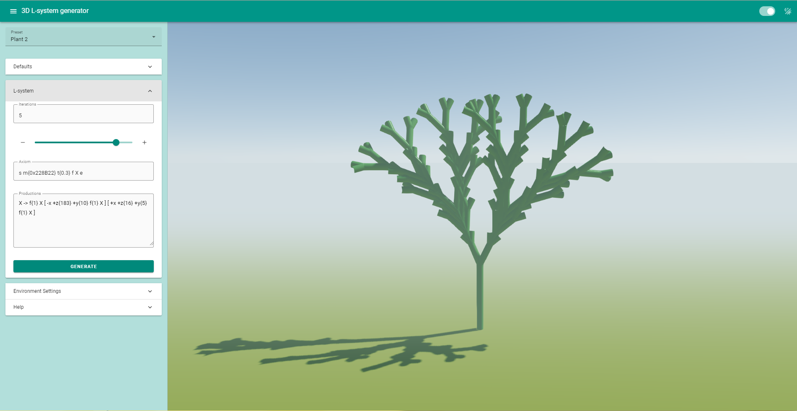

### Palm Tree
```
iterations: 8
axiom: J m{0x00FF00} K K K K K K K K K K K K K K K K K K K K
production rules:
J -> J m{0x964B00} -y cone s f e
K -> -z{30} [ -y{32} L A ]
L -> L -y{4}
A -> s f e [ -x{24} B ] -y{16} [ A ] [ +x{24} B ]
B -> s f e -y{16} B
cone -> m{0x964B00} cone{random()/7+0.3}
```

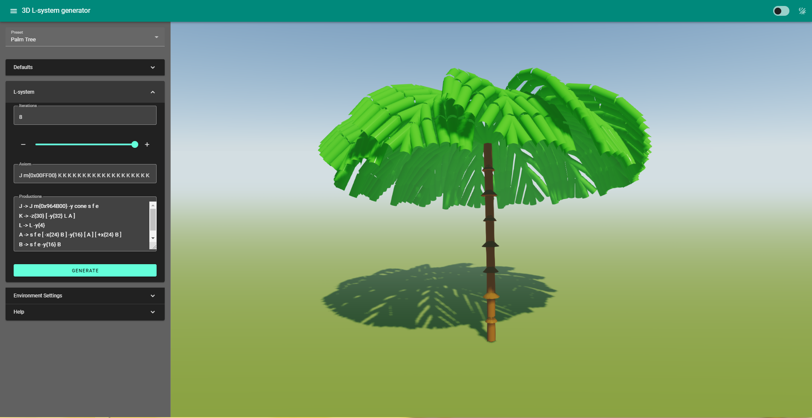

### Tree
```
iterations: 9
axiom: A B m{0x8B4513} sphere
production rules:
A -> s f f e
B -> r{0.08} C I +z{60} B
C -> C s f e
E -> -y{4} E
I -> r{0.04} J J J J J J J J
J -> +z{60} [ -y{48} E G ]
G -> r{0.08} C F [ -x{30} m{0x50C878} D sphere ] +y +y [ -x{30} m{0x50C878} D sphere ] G
D -> F [ -x{30} ] +y [ +x{30} ] D
cone -> m{0x50C878} cone{random()/5+0.1}
sphere -> m{0x50C878, 0.7, 0, false, true, false, true, 0.8, 2} sphere{random()/7+1, 12, 6, 0, pi/2, 0, pi}
```

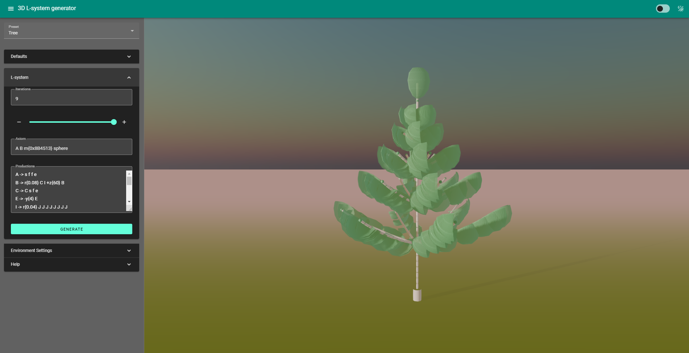

### Cartoon Tree
```
iterations: 9
axiom: A B m{0x8B4513} sphere
production rules:
A -> s f e
B -> r{0.4} C I +z{60} B
C -> C s f e
E -> -y{4} E
I -> r{0.4} J J J J J J J J
J -> +z{60} [ -y{12} E G ]
G -> r{0.08} C F [ -x{30} m{0x50C878} D cube ] +y +y [ -x{30} m{0x50C878} D cube ] G
D -> F [ -x{30} ] +y [ +x{30} ] D
sphere -> m{0x50C878} sphere{0.5}
cube -> m{0x50C878} cube{1}
```

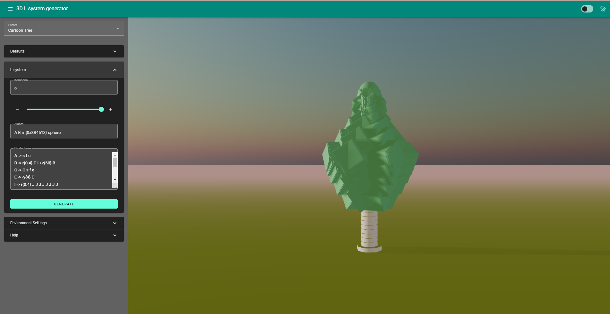

### Flower
```
iterations: 5
axiom: m{0x00FF00} J m{0xFF0000} K K K K K K K KK K K K K K K K K K K K
production rules:
J -> J -y s f f f e m{0x00FF00}
K -> -z{30} [ -y{32} L A ]
L -> L -y{4}
A -> s f e [ -x{24} B ] -y{16} [ A ] [ +x{24} B ]
B -> s f e -y{16} B
```

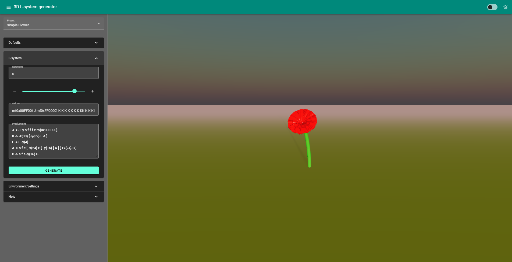

### Heighway Dragon (2D)
```
iterations: 5
axiom: s t{0.7} f X e
production rules:
X -> X +x Y f +x
Y -> -x f X -x Y
```

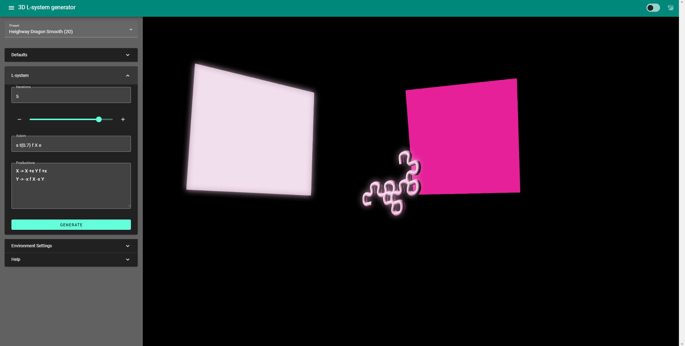

### Pentaplexity (2D)
```
iterations: 3
axiom: s m{0x66cdaa} f +x +x f +x +x f +x +x f +x +x f e
production rules:
f -> s f +x +x f +x +x f +x{180} f -x f +x +x f e
```

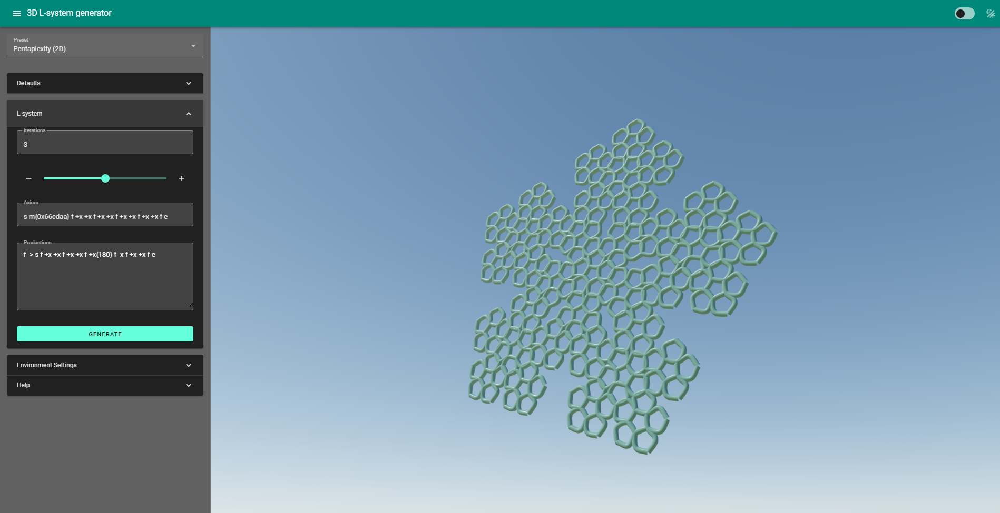

### Pattern (2D)
```
iterations: 4
axiom: s f e
production rules:
f -> f +x f -x f -x f +x f
```

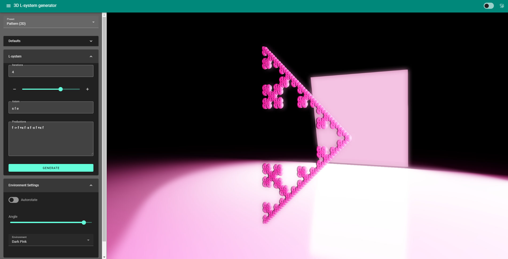
## Contributions

|                   | ABDAO, Regina | VILLARANTE, Gerizim |
| ----------------: | :------------ | :------------------ |
| Conceptualization | Proposed 2D L-Systems | Proposed 3D L-systems |
| Code              | <ul><li>Environments: Desert, Dark Pink</ul> | <ul><li>Initialized project and libraries to use<li>Language parser<li>Turtle commands<li>Environments: Sunset, Dark Neon, Nature, Sky</ul> |
| Examples created  | <ul><li>Plant 2<li>Palm Tree<li>Tree<li>Cartoon Tree<li>Flower<li>2D Examples</ul> | <ul><li>Plant<li>Hilbert curve<li>Sierpinski pyramid</ul> |
| Documentation     | Helped and finalized overall documentation | Helped in overall documentation |

## References and Inspiration
<ul><li><a href="http://www.geocities.ws/gplatl/LSystem/LSystem.html">3d Lindenmayer Systems by Mr. Pix</a><li><a href="https://en.wikipedia.org/wiki/L-system">L-Systems</a><li><a href="https://observablehq.com/@kelleyvanevert/3d-l-systems">3d L-Systems by Kelley van Evert</a></ul>

# Developer

## Recommended IDE Setup

[VSCode](https://code.visualstudio.com/) + [Volar](https://marketplace.visualstudio.com/items?itemName=johnsoncodehk.volar) (and disable Vetur) + [TypeScript Vue Plugin (Volar)](https://marketplace.visualstudio.com/items?itemName=johnsoncodehk.vscode-typescript-vue-plugin).

## Customize configuration

See [Vite Configuration Reference](https://vitejs.dev/config/).

## Project Setup

```sh
npm install
```

### Compile and Hot-Reload for Development

```sh
npm run dev
```

### Compile and Minify for Production

```sh
npm run build
```

### Push Compiled Production Build
```sh
git subtree push --prefix dist origin gh-pages
```

# License
